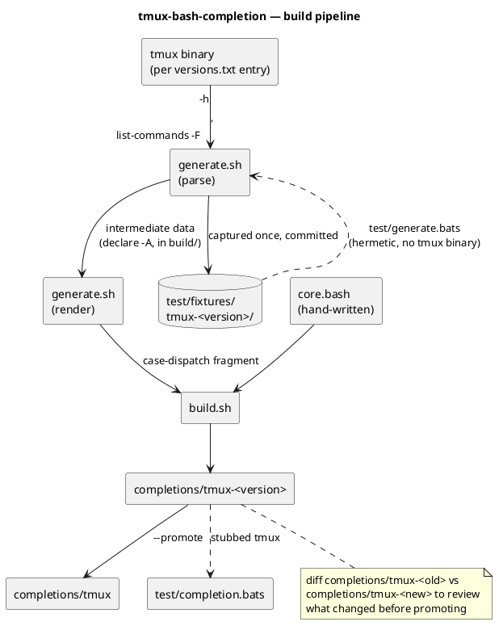

# Development

## Concept

* Don't hand-maintain flag lists. Ask tmux itself (`-h`, `list-commands
  -F`) what its commands and flags are, per version, and generate the
  completion dispatch from that.
* Track the result per tmux version (`versions.txt`) so each release's
  output is a committed, diffable file — `completions/tmux-<old>` vs
  `completions/tmux-<new>` shows exactly what changed before promoting one
  to the default `completions/tmux`.
* Eventual goal: run this against new tmux releases automatically (CI, not
  yet built) and only flag for human review when the diff is structural —
  a new/removed command, a new value-type needing a completer mapping —
  not when it's just new flags on an already-handled command, which the
  generator already handles with no review needed.



## Files

* `core.bash` — hand-written. Dynamic completers, `_tmux()` dispatcher. Edit
  this directly.
* `generate.sh` — parses a tmux binary's `-h`/`list-commands` output into
  per-command flag/completer data, renders it as a `case` block.
* `build.sh` — builds/caches a tmux binary per `versions.txt` entry, runs
  `generate.sh`, splices its output into `core.bash` to produce
  `completions/tmux-<version>`.
* `completions/tmux-<version>` — generated. Don't hand-edit; edit
  `core.bash` or `generate.sh` and rerun `build.sh`.
* `completions/tmux` — copy of the newest `completions/tmux-<version>`
  (or whichever was last `--promote`d).

## Building

```sh
./build.sh                        # rebuild every version in versions.txt
./build.sh 3.4                    # rebuild just one
./build.sh --promote 3.4          # also make it the unversioned completions/tmux
```

First run per version downloads + compiles that tmux release from source
(needs `libevent`, `ncurses`, `bison` dev headers) into `build/` (gitignored,
disposable). Repeat runs reuse the cached binary.

## versions.txt

One tmux version per line, oldest first, `#`-comments allowed. Last line =
default `completions/tmux`. To add a version: add a line, run `./build.sh`.

## tmux version support

This fork's floor: commit `e0f7021` (2016) moved dynamic completion onto
`-F` custom formats (`list-sessions -F`, etc.). Anything using those
formats works back to roughly that tmux era.

## Running the tests

Tests use [bats-core](https://github.com/bats-core/bats-core).

```sh
# install (pick one)
brew install bats-core
sudo apt install bats

# run everything
bats test/
```

- `test/generate.bats` is hermetic: no tmux binary or network needed, it's
  driven entirely from the captured fixtures in `test/fixtures/`.
- `test/completion.bats` tests the real `completions/tmux` already in your
  working tree — it doesn't build anything itself. Run `./build.sh` first
  if that file doesn't exist yet. To test a specific version instead of
  whatever's currently promoted: `./build.sh --promote 3.4 && bats
  test/completion.bats`.
